# StoreKit Super Admin — Complete Implementation Report

Evidence date: 2026-07-18  
Evidence scope: current local worktree and local automated validation; deployed infrastructure is explicitly excluded unless stated  
Companion evidence: `SUPER_ADMIN_PHASE_1_AUDIT.md`, `SUPER_ADMIN_IMPLEMENTATION_LOG.md`, `SUPER_ADMIN_MASTER_READINESS.md`

## Executive outcome

StoreKit now contains an integrated enterprise SaaS Control Center rather than a separate replacement application. The implementation preserves the tenant storefront and tenant Admin boundaries while adding modular platform operations, tenant governance, billing, users, dynamic RBAC, security, audit, integrations, monitoring, analytics, feature flags, notifications, support, backup/recovery and developer tooling.

The codebase is materially implemented but is not certified production-ready. Local evidence proves compilation and covered application contracts; it does not prove provider credentials, deployed indexes, browser rendering, restore outcomes, load capacity, Google indexing or uninterrupted operation. Mandatory production gates are listed below.

## Evidence snapshot

| Inventory | Current source evidence |
|---|---:|
| Private Super Admin endpoint declarations | 168 |
| Super Admin route modules, including the compatibility router | 16 |
| Registered dynamic permissions | 42 across 15 groups |
| Backend model files excluding the model barrel | 62 |
| Permission-filtered Control Center modules | 20 |
| Dedicated Super Admin page files | 18 |
| Backend test files | 37 |
| Latest complete backend result | 223 passed, 0 failed |
| Latest frontend result | Optimized production build compiled successfully |

Counts are derived from `backend/routes/superadmin*`, `backend/config/platformPermissions.js`, `backend/models`, `frontend/src/pages/superadmin` and `backend/tests`. They describe source inventory, not deployed reachability.

## Architecture diagram

```mermaid
flowchart TD
  Browser[Super Admin browser] --> Login[Password or allowlisted Google sign-in]
  Login --> MFA[TOTP enrollment / challenge / recent step-up]
  MFA --> Shell[Lazy-loaded Control Center shell]
  Shell --> API[/api/superadmin/*]
  API --> Context[Request and correlation context]
  Context --> Session[Revocable database-backed session]
  Session --> RBAC[Dynamic role and permission evaluation]
  RBAC --> Audit[Redacted persistent audit middleware]
  Audit --> Modules[Domain route modules]
  Modules --> Services[Domain services and policy engines]
  Services --> Mongo[(MongoDB)]
  Services --> Workers[Durable workers and schedulers]
  Services --> Keyring[Deployment-managed versioned keyrings]
  Keyring --> Secrets[Encrypted integration/MFA/backup payloads]
  Services --> Providers[Stripe / mail / storage / OAuth / notifications / AI health checks]
  Workers --> Telemetry[Metrics, jobs, errors and alerts]

  TenantAdmin[Tenant Admin] --> TenantAPI[Tenant-scoped APIs]
  Storefront[Customer storefront] --> PublicAPI[Domain-resolved public APIs]
  TenantAPI --> Mongo
  PublicAPI --> Mongo
  API -. explicit impersonation session .-> TenantAdmin
```

Security boundaries:

- Platform access requires an active tenantless `superadmin` identity, a valid revocable session and a dynamic permission.
- Sensitive mutations add recent MFA, exact confirmation or both.
- Tenant Admin and public routes retain tenant context derived from authenticated identity or verified domain resolution.
- Impersonation creates a short-lived, attributable session; it does not mutate the platform token into an untracked tenant token.
- Root cryptographic material remains in deployment secrets and never enters MongoDB or browser responses.

## Database diagram

This domain relationship diagram covers the Control Center's authoritative relationships. Exact fields, validation and indexes remain authoritative in `backend/models/*.js`.

```mermaid
erDiagram
  TENANT ||--o{ USER : owns
  TENANT ||--o{ PRODUCT : catalogs
  TENANT ||--o{ ORDER : receives
  TENANT }o--|| PLAN : subscribes
  TENANT ||--o{ SUBSCRIPTION_INVOICE : billed
  TENANT ||--o{ TENANT_PAYMENT : pays
  TENANT ||--o{ BILLING_REFUND : refunded
  TENANT ||--o{ BILLING_DUNNING_EVENT : dunning
  TENANT ||--o{ ENTERPRISE_CONTRACT : contracts
  TENANT ||--o{ TENANT_NOTE : annotated
  TENANT ||--o{ BACKUP : recovery_points
  TENANT ||--o{ BEHAVIOR_EVENT : consented_activity
  TENANT ||--o{ FEATURE_FLAG_EXPOSURE : exposed
  TENANT ||--o{ SUPPORT_TICKET : requests
  SUPPORT_TICKET ||--o{ SUPPORT_MESSAGE : contains

  USER }o--o{ PLATFORM_ROLE : assigned
  PLATFORM_ROLE }o--o{ PLATFORM_PERMISSION : grants
  USER ||--o{ AUTH_SESSION : authenticates
  USER ||--o{ MFA_FACTOR : verifies
  USER ||--o{ AUTH_EVENT : emits
  USER ||--o{ AUDIT_EVENT : acts

  RUNTIME_FEATURE_FLAG ||--o{ FEATURE_FLAG_EXPOSURE : records
  PLATFORM_ANNOUNCEMENT ||--o{ NOTIFICATION_DELIVERY : queues
  PLATFORM_NOTIFICATION_TEMPLATE ||--o{ NOTIFICATION_DELIVERY : renders
  PLATFORM_API_KEY ||--o{ API_USAGE_EVENT : meters
  ALERT_RULE ||--o{ ALERT_EVENT : triggers

  PLATFORM_INTEGRATION }o--|| CRYPTOGRAPHIC_KEY_ATTESTATION : lifecycle_evidence
  BACKUP }o--|| CRYPTOGRAPHIC_KEY_ATTESTATION : key_custody
  PLATFORM_API_KEY ||--o{ DEPLOYMENT_RECORD : reports
```



Database migration posture:

- Changes are additive: new collections, optional fields, compound/TTL/unique indexes and versioned encrypted payload metadata.
- Legacy backup and no-`kid` JWT formats have bounded compatibility paths documented in the implementation log.
- Deployment must run schema/index synchronization before exposing new high-cardinality analytics or saved-view paths.
- Production database and index state must be inventoried from the deployed MongoDB cluster; model declarations alone are insufficient proof.

## Permission matrix

| Group | Permissions | Sensitive behavior |
|---|---|---|
| platform | `platform.view`, `platform.edit` | platform overview and core changes |
| tenant | `tenant.view`, `tenant.create`, `tenant.edit`, `tenant.suspend`, `tenant.impersonate`, `tenant.delete` | impersonation and deletion require stronger controls |
| billing | `billing.view`, `billing.update`, `billing.refund` | refunds/contracts use step-up and audit |
| analytics | `analytics.view`, `analytics.export`, `analytics.manage` | acquisition ledger mutations use step-up |
| users | `users.view`, `users.invite`, `users.edit`, `users.suspend`, `users.delete` | lifecycle actions revoke sessions and are audited |
| roles | `roles.view`, `roles.manage` | role mutations use step-up |
| security | `security.view`, `security.manage` | key/firewall/session mutations use step-up and confirmations |
| featureflags | `featureflags.view`, `featureflags.manage` | kill/restore uses step-up |
| support | `support.view`, `support.reply`, `support.manage` | internal notes are platform-only |
| audit | `audit.view`, `audit.export` | CSV output is injection-safe |
| monitoring | `monitoring.view`, `monitoring.manage` | alert mutation is audited |
| notifications | `notifications.view`, `notifications.manage`, `notifications.send` | deployment trigger uses step-up |
| infrastructure | `infrastructure.view`, `infrastructure.manage` | integration secrets/backups use step-up |
| developer | `developer.view`, `developer.api`, `developer.manage` | API-key lifecycle uses step-up |
| settings | `settings.view`, `settings.manage` | global setting changes use step-up |

`backend/config/platformPermissions.js` is the registry source; `PlatformPermission`, `PlatformRole` and operator role assignments are persistent. Enable strict explicit-role enforcement only after reconciling every production operator and preserving two recovery owners.

## Feature matrix

| Capability | Implementation state | Production evidence state |
|---|---|---|
| Dashboard and global navigation | Implemented with live database aggregation, permission filtering, lazy modules and authoritative recent deployment records | Seeded staging card and CI/CD event reconciliation required |
| Tenant portfolio and lifecycle | Implemented | Load, browser and destructive-action staging drills required |
| Plans, subscriptions and commercial billing | Implemented | Stripe test-mode replay and reconciliation required |
| Platform users and dynamic RBAC | Implemented | Google OAuth/mail delivery and explicit-role migration required |
| Security Center and audit | Implemented application controls | Trusted-edge geo and secret-manager rotation drills required |
| Platform settings and integrations | Implemented registry and encrypted storage | Provider credentials/callbacks require live verification |
| Notifications and support | Implemented durable queue, permission-aware versioned template editing and authenticated realtime support | Channel delivery and proxy/reconnect tests required |
| Monitoring and infrastructure | Implemented application telemetry and durable deployment lifecycle registry | Host/provider metrics, CI/CD event setup, SLOs and on-call setup remain |
| Feature flags and experiment outcomes | Implemented | Production-shaped query plans and sample validation required |
| Platform analytics | Implemented core metrics, manual ledger, automated idempotent Meta and Google Ads campaign-spend reconciliation, and consented aggregate coordinate heatmaps | Live provider reconciliation plus privacy/browser proof remain |
| Developer Center | Implemented API keys, usage, webhooks, scoped deployment ingestion, OpenAPI and SDK ZIPs | Optional registry publication and live CI/client test remain |
| Backup and recovery | Implemented encrypted tenant/platform paths | Isolated restore drill and key escrow proof required |
| UX/accessibility/performance | Substantial implementation | Rendered assistive-tech, device and load/Core Web Vitals proof remain |
| SEO/customer discovery | Application support implemented | Google crawl/index/ranking cannot be guaranteed by application code |

## API inventory

All private endpoints inherit Super Admin authentication, MFA-enrollment enforcement, dynamic permission evaluation and platform audit middleware. Endpoint declarations by source module:

| Mounted prefix / source | Declarations | Primary responsibility |
|---|---:|---|
| compatibility routes in `superadmin.js` | 26 | dashboard, plans, tenants, domains and legacy-compatible operations |
| `/access` | 10 | roles and platform operator lifecycle |
| `/analytics` | 15 | overview, series, retention, adoption, funnel, privacy-safe click heatmap, Meta/Google Ads acquisition ledger/sync and export |
| `/audit` | 3 | search, filters and CSV export |
| `/billing` | 18 | invoices, attempts, refunds, reconciliation, portal, coupons, taxes and contracts |
| `/developer` | 11 | API keys, usage, webhooks, OpenAPI and SDK packages |
| `/runtime-flags` | 8 | flag lifecycle, simulation, exposures and experiment outcomes |
| `/integrations` | 3 | registry list, encrypted update and health test |
| `/notifications-center` | 14 | overview, templates, announcements, automations, deliveries and worker |
| `/operations` | 12 | health, metrics, errors, jobs, deployment history/ingestion and alert lifecycle |
| `/platform-backups` | 5 | create, list, verify, restore and delete recovery points |
| `/platform-settings` | 2 | typed settings read/update |
| `/search` | 1 | permission-filtered global search |
| `/security` | 12 | sessions, auth events, firewall and key lifecycle |
| `/support` | 11 | realtime stream, tickets/messages/escalation and knowledge base |
| `/tenant-workspace` | 17 | directory/detail, views, metadata, notes, archive, owner and impersonation |
| **Total** | **168** | source declarations; generated/runtime middleware endpoints excluded |

The external `/api/platform/v1` contract is separately authoritative in `backend/config/platformOpenApi.js` and is packaged with generated JavaScript/Python SDK ZIPs. The private Control Center is intentionally not represented as a public SDK contract.

## UI screen inventory

| Screen/module | Permission | Integrated capability |
|---|---|---|
| Login | public allowlisted entry | password and Google sign-in, rate limits, MFA challenge |
| MFA enrollment | authenticated enrollment state | TOTP setup and recovery codes |
| Overview | `platform.view` | executive metrics, graphs, alerts, permission-gated recent deployments and quick actions |
| Plans | `billing.view` | plan pricing, limits and feature catalog |
| Tenants | `tenant.view` | creation and core tenant lifecycle |
| Billing | `billing.view` | commercial billing and lifecycle controls |
| Domains | `tenant.view` | tenant domain inventory/configuration |
| Feature Governance | `featureflags.view` | plan entitlement governance |
| Runtime Flags | `featureflags.view` | targeting, rollout, experiments and kill switch |
| Access Control | `roles.view` | operators, roles and permission matrix |
| Audit Trail | `audit.view` | search, filters, timeline and export |
| Tenant Workspace | `tenant.view` | portfolio, saved views, inline metadata, health and impersonation |
| Security Center | `security.view` | sessions, auth events, firewall and key custody |
| Platform Settings | `settings.view` | typed global configuration |
| Integrations | `infrastructure.view` | encrypted provider configuration and tests |
| Operations | `monitoring.view` | metrics, errors, jobs, deployment lifecycle, dependencies and alerts |
| Backups | `infrastructure.view` | platform recovery lifecycle |
| Notifications | `notifications.view` | permission-aware automations, inline versioned templates, announcements and delivery queue |
| Support | `support.view` | realtime queue, tickets, internal notes and knowledge base |
| Analytics | `analytics.view` | SaaS metrics, funnel, heatmap, CAC and adoption |
| Developers | `developer.view` | API keys, usage, webhook logs, deployment scopes, OpenAPI and SDKs |

The shell provides permission-filtered navigation, breadcrumbs, global search, command palette, module error boundaries, Suspense loading, responsive navigation and reduced-motion handling. Screenshot/rendered-browser proof is not available in the current environment and is not claimed.

## Deployment notes

1. Back up production and verify an isolated restore before schema/index synchronization.
2. Deploy backend first; synchronize MongoDB indexes and capture explain plans for tenant, audit, usage and analytics queries.
3. Configure versioned JWT, platform-secret and backup keyrings in the deployment secret manager; never paste root key material into the Control Center.
4. Reconcile operator roles, enroll MFA, retain two tested recovery owners and enable strict role enforcement only after the report is clean.
5. Configure provider credentials in staging and exercise Stripe, email, storage, OAuth, notifications, Anthropic health, Cloudinary and backup workflows.
6. Configure the trusted-edge geo header/secret and prove direct-origin denial before enabling country blocking.
7. Confirm proxies permit authenticated SSE without buffering and load-test connection limits across replicas.
8. Run browser accessibility/device QA, production-shaped load/soak tests and Core Web Vitals measurement.
9. Define SLOs, alert destinations, escalation ownership, RPO/RTO, key rotation and incident runbooks.
10. Verify Search Console, Merchant Center, sitemap/feed retrieval and deployed structured data separately.

## Security checklist

| Control | State | Evidence / remaining gate |
|---|---|---|
| Revocable authenticated sessions | Implemented | `AuthSession`, token version and session checks |
| Google sign-in allowlist | Implemented | no automatic Super Admin creation/promotion; live OAuth remains |
| TOTP MFA and recent step-up | Implemented | enrollment/challenge/recovery tests; recovery-owner drill remains |
| Dynamic RBAC | Implemented | 42 registered permissions and persisted roles |
| Persistent redacted audit | Implemented | old/new values, request context, duration and correlation ID |
| Rate limiting and account lockout | Implemented | runtime middleware and authentication-event tests |
| CSRF posture | Implemented for bearer-header APIs | no ambient auth cookies; deployment must preserve this boundary |
| XSS/input sanitization/CSP | Implemented in key paths, partial deployment proof | CSP/header and rendered injection tests remain |
| Secret encryption | Implemented | AES-GCM keyring; staging rotation/retirement drill remains |
| JWT signing rotation | Implemented | versioned `kid`; maximum-token-lifetime retirement gate remains |
| Firewall/IP/geo/path controls | Implemented | trusted edge required for enforceable country data |
| Backup confidentiality/integrity | Implemented | encrypted authenticated archives; restore drill remains |
| Webhook authenticity/idempotency | Implemented for covered providers | provider staging replay required |
| Tenant isolation | Implemented in covered routes/tests | production penetration and data-boundary review remains |

## Performance checklist

| Control | State | Evidence / remaining gate |
|---|---|---|
| Route/module code splitting | Implemented | lazy Control Center modules and successful production build |
| Bounded pagination/query limits | Implemented broadly | high-cardinality explain plans remain |
| Queue virtualization | Implemented on support queue | broaden only where profiling proves need |
| Resizable table persistence | Implemented on Developer usage | presentation state remains browser-local |
| TTL retention | Implemented for telemetry/exposure/usage domains | deployed TTL index verification remains |
| Durable background work | Implemented with Mongo claims/idempotency | concurrency/soak tests remain |
| Caching | Bounded application caches implemented | Redis/distributed cache and hit telemetry remain |
| Optimistic concurrency | Implemented for inline tenant metadata and notification templates | multi-browser conflict staging test remains |
| Frontend performance | Build/code splitting implemented | Core Web Vitals and device profiling remain |
| Capacity/SLO evidence | Missing externally | production-shaped load, saturation and recovery tests required |

## Testing checklist

| Test domain | Current evidence | Required external proof |
|---|---|---|
| Backend/source contracts | 223 passed, 0 failed | continue on every change |
| Frontend compilation | optimized production build successful | browser E2E and visual regression |
| Authentication/RBAC/MFA | automated contract and helper tests | live Google OAuth and recovery exercise |
| Tenant isolation/deletion/impersonation | automated registry and route contracts | staging multi-tenant penetration scenarios |
| Billing | lifecycle, quote, refund and scheduler tests | Stripe test-mode webhook/refund/portal replay |
| Encryption/backups/key rotation | crypto/tamper/migration tests | isolated restore and secret-manager rotation drill |
| Analytics/flags | deterministic methodology and privacy tests | production-shaped query/sample validation |
| Notifications/support realtime | queue/idempotency/SSE contracts | configured-channel and multi-browser proxy tests |
| Accessibility/responsive | source contracts and successful build | keyboard, screen reader, contrast and real devices |
| Performance/resilience | bounded structures and worker contracts | load, soak, failover and Core Web Vitals |

## Production readiness score

The score is a transparent risk-tracking rubric, not certification. Each category is scored only for evidence available in the current worktree; missing deployed proof reduces the result.

| Category | Weight | Earned | Rationale |
|---|---:|---:|---|
| Architecture and isolation | 15 | 14 | clear platform/tenant boundaries; deployed penetration proof absent |
| Functional master-scope breadth | 20 | 17 | broad integrated modules; provider production proof and some UX breadth remain |
| Security controls | 15 | 12 | strong application controls; edge/secret-manager drills remain |
| Data protection and recovery | 10 | 6 | encrypted recovery exists; restore/RPO/RTO proof absent |
| Integrations | 10 | 4 | registry/tests exist; live credentials and callbacks largely absent |
| Monitoring and operations | 10 | 7 | durable telemetry/alerts exist; SLO/on-call/provider metrics incomplete |
| Performance and scale | 8 | 4 | bounded architecture exists; load/query-plan evidence absent |
| UX and accessibility | 7 | 4 | substantial source implementation; rendered audit absent |
| Deployment evidence | 5 | 1 | local tests/build only |
| **Production readiness** | **100** | **69/100** | **Not approved for production until mandatory gates pass** |

## Code quality score

| Category | Weight | Earned | Rationale |
|---|---:|---:|---|
| Modularity and boundaries | 20 | 17 | modular routes/services/models; compatibility router remains large |
| Security and correctness | 25 | 22 | strong validation, RBAC, audit and crypto coverage |
| Automated verification | 20 | 17 | 223 passing tests; many are source contracts rather than live integration tests |
| Maintainability | 15 | 12 | registries and reusable components; several dense legacy UI files remain |
| Performance engineering | 10 | 7 | pagination, TTLs, queues, lazy loading and virtualization present |
| Documentation | 10 | 9 | audit, increment log, readiness matrix and this report present |
| **Code quality** | **100** | **84/100** | **Strong local implementation; production proof is tracked separately** |

## Remaining recommendations

Priority order:

1. Complete the ten production gates in `SUPER_ADMIN_MASTER_READINESS.md` and attach dated evidence.
2. Validate Meta and Google Ads synchronization against provider consoles in staging; add another acquisition provider only after its OAuth, currency, idempotency and reconciliation contract is defined.
3. Complete a privacy/legal review, production-index verification and rendered-browser validation of the consented aggregate click heatmap before enabling it for production operators.
4. Add further domain-specific inline editors only where dedicated permission, validation, audit and optimistic-concurrency safeguards are preserved.
5. Publish generated SDKs only after versioning, signing, changelog and release ownership are defined.
6. Reduce the legacy compatibility router and dense dashboard file incrementally after rendered regression coverage exists.
7. Recalculate scores only when evidence changes; never raise readiness based solely on source presence.

## Release decision

Current decision: **conditional hold**. The implementation is suitable for staging validation. It is not evidence-backed for unrestricted production use until provider configuration, key/restore drills, index/query verification, accessibility/browser testing, load/soak testing, SLO/on-call setup and live SEO/provider checks are complete.
